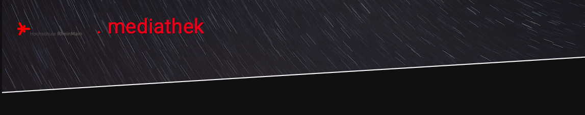

# HLS-Videostreaming

## Overview

This repository contains the source code for a web-based HLS (HTTP Live Streaming) video streaming client designed to play video content hosted on AWS. The project was developed as part of the "Computer and Media Networking II Lab" course in the "Media Technology" program at the University of Applied Sciences RheinMain.

## Project Description

The client is implemented in HTML5 and includes an embedded video player that streams video content using HLS from a server in the Amazon Cloud. Access and metadata of the videos are retrieved through an API, ensuring dynamic content delivery and management.

Please note that the videos and metadata originally hosted on AWS for this project are no longer available online.

## Setup and Usage

To use this project:

1. Clone the repository to your local machine.
2. Open `cmn2_webentwicklung.html` in a web browser to view the client interface.
3. Since the AWS-hosted videos and metadata are not available, you will need to provide your own HLS video sources and update the API calls within the JavaScript files accordingly.

## License

This project is open-sourced under the [MIT license](LICENSE).
